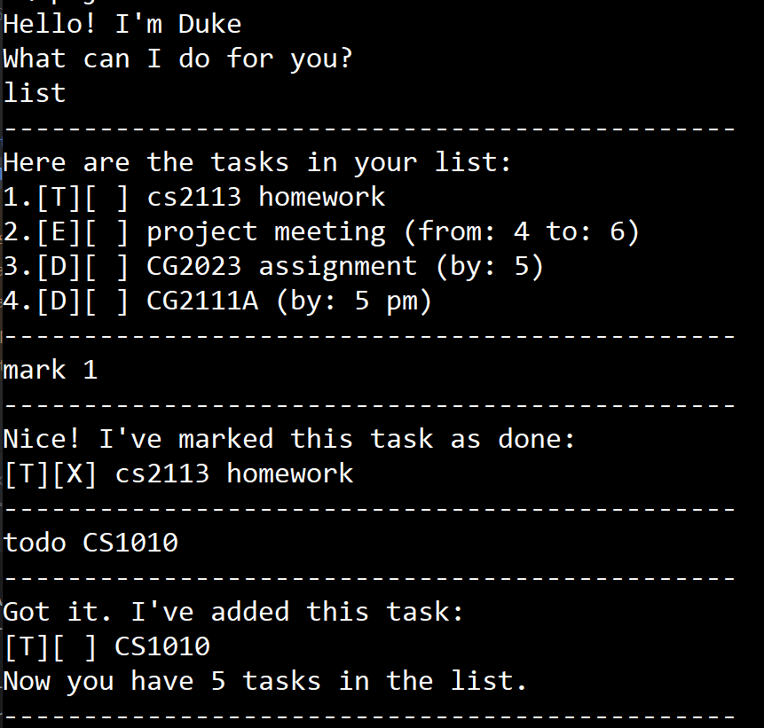

# Duke User Guide


## Introduction
Duke is a simple chatbot that allows users to manage their tasks efficiently. Users can add, list, mark, unmark, delete, and find tasks. The chatbot saves tasks to a file and loads them automatically upon startup.

## Getting Started

### Running main.Duke
To start main.Duke, run the `main.Duke` Java program in your terminal or IDE. The chatbot will greet you with:
```
Hello! I'm main.Duke
What can I do for you?
```

## Features

### 1. Listing All Tasks
**Command:** `list`

Displays all tasks stored in the task list.

Example: `list`

```
1. [T][ ] Read a book
2. [D][ ] Submit assignment (by: Monday)
3. [E][ ] Team meeting (from: 2pm to: 4pm)
```

### 2. Adding Tasks
main.Duke supports three types of tasks:
- **Todo**
- **Deadline**
- **Event**

#### a) Adding a Todo Task
**Command:** `todo <task description>`

Example: `todo Read a book`

```
Got it. I've added this task:
[T][ ] Read a book
Now you have 1 task in the list.
```

#### b) Adding a deadline task
**Command:** `deadline <task description> /by <due date>`

Adds a task with a deadline to the list.

Example: `deadline Submit assignment /by Monday`

```
Got it. I've added this task:
[D][ ] Submit assignment (by: Monday)
Now you have 2 tasks in the list.
```

#### c) Adding an event task 
**Command:** `event <task description> /from <start time> /to <end time>`

Example: `event Team meeting /from 2pm /to 4pm`

```
Got it. I've added this task:
[E][ ] Team meeting (from: 2pm to: 4pm)
Now you have 3 tasks in the list.
```

### 3. Marking Tasks as Done
**Command:** `mark <task number>`

Example: `mark 1`

```
Nice! I've marked this task as done:
[T][X] Read a book
```

### 4. Marking Tasks as Not Done
**Command:** `unmark <task number>`

Example: `unmark 1`

```
OK, I've marked this task as not done yet:
[T][ ] Read a book
```

### 5. Deleting a tasks.Task
**Command:** `delete <task number>`

Example: `delete 2`

```
Noted. I've removed this task:
[D][ ] Submit assignment (by: Monday)
Now you have 2 tasks in the list.
```

### 6. Finding Tasks
**Command:** `find <keyword>`

Example: `find book`

```
Here are the matching tasks in your list:
1. [T][ ] Read a book
```

### 7. Exiting main.Duke
**Command:** `bye`

Example: `bye`

```
Bye. Hope to see you again soon!
```

## tasks.Task storage.storage
main.Duke saves tasks in a file located at `docs/duke.txt`. The file is automatically created if it does not exist, and tasks are loaded when main.Duke starts.

## Error Handling
main.Duke handles invalid inputs gracefully and provides error messages to guide the user.

Example of an error message:
```
Oops! The description of a todo cannot be empty.
```
